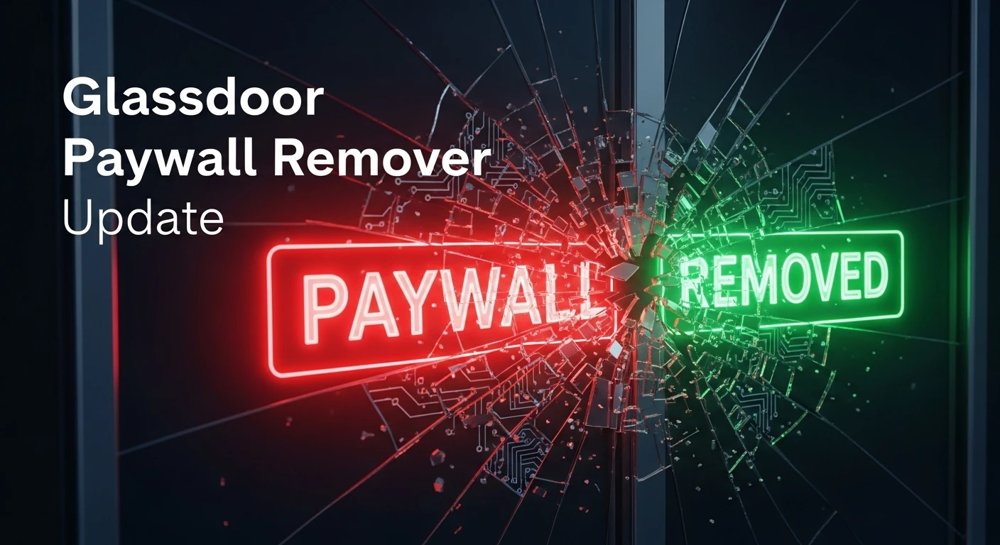

# Glassdoor Paywall Remover Update

Readme: [EN](README.md)

 

Este é um Userscript (script de usuário) desenvolvido para remover o bloqueio de login (paywall), overlays intrusivos e destravar a rolagem de página no site Glassdoor.

O script foi atualizado para lidar com as novas implementações do Glassdoor (2026), que utilizam renderização dinâmica via React/Next.js e bloqueios agressivos de CSS inline na tag `<body>`.

## Funcionalidades

* **Remove o Modal de Login Unificado:** Oculta automaticamente o container `#unified-user-auth` e outros overlays de "Hardsell" que impedem a visualização do conteúdo.
* **Destrava a Rolagem (Scroll):** Monitora a tag `<body>` e remove instantaneamente atributos `style="overflow: hidden; position: fixed;"` que o site tenta aplicar para impedir que você role a página.
* **Performance Otimizada:** Utiliza `MutationObserver` e injeção de CSS com `!important` para garantir que o desbloqueio ocorra antes mesmo do elemento ser renderizado visualmente, evitando "flashes" do bloqueio.
* **Resiliente:** Funciona mesmo quando o Glassdoor tenta recolocar o bloqueio via navegação SPA (Single Page Application).

## Instalação

### Pré-requisitos

Você precisa de uma extensão gerenciadora de scripts instalada no seu navegador:

* [Tampermonkey](https://www.tampermonkey.net/) (Recomendado)
* [Violentmonkey](https://violentmonkey.github.io/)
* [Greasemonkey](https://www.greasespot.net/)

### Instalando o Script

1.  Certifique-se de ter o Tampermonkey (ou similar) instalado.
2.  **[Clique aqui para instalar o script](https://greasyfork.org/pt-BR/scripts/531857-glassdoor-paywall-remover-update)**.
3.  O Tampermonkey abrirá uma aba pedindo confirmação. Clique em **Instalar**.
4.  Acesse qualquer página do Glassdoor (ex: avaliações de empresas) e o conteúdo estará liberado.

## Como funciona (Técnico)

O script atua em duas frentes principais para vencer a renderização do React:

1.  **CSS Force:** Injeta regras CSS globais que aplicam `display: none !important` nos IDs e Classes conhecidos dos modais de bloqueio e força `overflow: auto` no `html` e `body`.
2.  **DOM Watcher:** Um `MutationObserver` vigia atributos da tag `<body>`. Assim que o JavaScript do Glassdoor adiciona `overflow: hidden`, o script detecta a mudança e remove o atributo `style` inteiro, devolvendo o controle da página ao usuário.

## Changelog

* **v1.2:**
    * Atualização da lógica para focar no container `#unified-user-auth`.
    * Implementação de limpeza agressiva de atributos na tag `<body>`.
    * Tradução de comentários e descrições para Inglês (padrão global).

## Aviso Legal

> [!WARNING]
> Este software é fornecido "como está". Certifique-se sempre de testar primeiro em um ambiente de desenvolvimento. O autor não se responsabiliza por qualquer uso indevido, consequências legais ou impacto em dados causado por esta ferramenta.

## Tutorial Detalhado

Para um guia passo a passo completo confira meu artigo completo:

👉 [**Remove Paywall from Glassdoor**](https://perciocastelo.com.br/blog/remove-paywall-from-glassdoor.html)

## License

Este projeto está licenciado sob a **GNU General Public License v3.0**. Veja o arquivo [LICENSE](LICENSE) para mais detalhes.